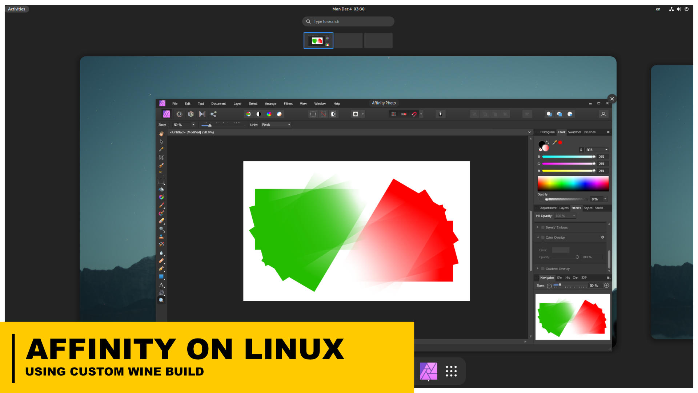

# Install Affinity apps (Designer / Photo) on Debian Linux



This is a step-by-step tutorial to make you install Affinity apps on Linux, covers some issues you might run into when following the [original guide](https://forum.affinity.serif.com/index.php?/topic/182758-affinity-suite-v204-on-linux-wine/). And I also do things differently, so keep that in mind. This repo is intend to guide myself to setup Affinity when I need to do it in the near future, but I'll love to see anyone else can benifit from this guide.

Thanks to James McDonnell's work [ElementalWarrior-wine](https://gitlab.winehq.org/ElementalWarrior/wine), this custom build of wine can run Affinity apps in linux with basic functions (saving, editing) working properly. Which becomes the best option to run Affinity on Linux for now, since other alternatives like [Lutris](https://lutris.net/) still suffers to get the directory linking working, [Bottles](https://usebottles.com/) still glitches, [Winapps](https://github.com/Fmstrat/winapps) is hard to setup if you need hardware acceleration.

Big shout out to <b>James McDonnell</b>, he's doing god's work.

# Reference

[Affinity Suite v2.0.4 on linux [ Wine ]](https://forum.affinity.serif.com/index.php?/topic/182758-affinity-suite-v204-on-linux-wine/)

---

# Installation

## Get WinMetadata/ from Windows System

You will need to get WinMetadata/ files from a windows virtual machine, partition or from a friend

<aside>
💡 For convenience, the needed file is provided below:

[WinMetadata.zip](WinMetadata.zip)

</aside>

This folder in Windows is located in:

```bash
C:/Windows/System32/WinMetadata
```

## Install wine (custom build)

1. Install dependencies needed to build wine
    
    <aside>
    💡 For details or other distros, see:
    https://wiki.winehq.org/Building_Wine#Satisfying_Build_Dependencies
    
    </aside>
    

    ```bash
    # You need git.
    sudo apt install git
    
    # Common graphics library
    sudo apt install nvidia-driver libvulkan1
    
    # Common build dependencies
    sudo apt install gcc flex bison
    
    # Wine
    sudo apt install wine winetricks
    
    # Wine build dependencies (x86 specific)
    sudo apt install libx11-dev:i386 libfreetype6-dev:i386
    
    # Wine build dependencies - necessary
    sudo apt install gcc-multilib gcc-mingw-w64 libasound2-dev libdbus-1-dev libfontconfig-dev libfreetype-dev libgnutls28-dev libgl-dev libunwind-dev libx11-dev libxcomposite-dev libxcursor-dev libxfixes-dev libxi-dev libxrandr-dev libxrender-dev libxext-dev
    
    # Wine build dependencies - needed often
    sudo apt install libgstreamer1.0-dev libgstreamer-plugins-base1.0-dev libosmesa6-dev libsdl2-dev libvulkan-dev
    
    # (Optional) reboot the system for drivers to work
    systemctl reboot
    
    ```

1. Get ElementalWarrior wine fork:
    
    ```bash
    cd ~/Documents
    git clone https://gitlab.winehq.org/ElementalWarrior/wine.git ElementalWarrior-wine
    ```
    

1. Create new folders for building wine
    
    ```bash
    cd ~/Documents/ElementalWarrior-wine/
    
    mkdir wine32-build/ wine64-build/ wine-install/
    ```
    

1. Build wine64, configure with your $USER
    
    ```bash
    cd ~/Documents/ElementalWarrior-wine/wine64-build/
    
    /home/$USER/Documents/ElementalWarrior-wine/configure --prefix=/home/$USER/Documents/ElementalWarrior-wine/wine-install --enable-win64
    
    # Run in threads to speed up, up this number if you have a powerful PC
    make -j 8 
    ```
    

1. Build wine32, configure path with your $USER
    
    ```bash
    cd ~/Documents/ElementalWarrior-wine/wine32-build/
    
    PKG_CONFIG_PATH=/usr/lib32/pkgconfig /home/$USER/Documents/ElementalWarrior-wine/configure --with-wine64=/home/$USER/Documents/ElementalWarrior-wine/wine64-build --prefix=/home/$USER/Documents/ElementalWarrior-wine/wine-install
    
    # Run in threads to speed up, up this number if you have a powerful PC
    make -j 8
    ```
    

1. Wait for it to finish and install wine-32 build with:
    
    ```bash
    make install
    ```
    
    You now have a folder containing a build of ElementalWarrior's wine fork, the built binary is inside wine-install/ now
    
2. Copy the wine custom build to a folder you desired
    
    ```bash
    mkdir ~/.local/wine
    
    cp -r ~/Documents/ElementalWarrior-wine/wine-install ~/.local/wine/ElementalWarrior-wine
    ```
    

1. Create new wine prefix and install dotnet4.8, corefonts (may took a while)
    
    ```bash
    mkdir ~/wine
    
    WINEPREFIX=~/wine/affinity winetricks
    ```
    
    1. Choose “Select the default wineprefix”
    2. In “Install a Windows DLL or component”, choose and install **dotnet48**
    3. In “Install a font”, choose and install **corefonts**
    
    Or you can just do it in command line:
    
    ```bash
    WINEPREFIX=~/wine/affinity winetricks dotnet48 corefonts
    ```
    
2. Set the wines Windows version to win10:
    
    ```bash
    WINEPREFIX=~/wine/affinity winecfg -v win10
    ```
    

1. Copy the WinMetadata/ folder into the drive_c in this config, where ever $PATH_TO is:
    
    ```bash
    cp -r /$PATH_TO/WinMetadata/ ~/wine/affinity/drive_c/windows/system32/
    ```
    
    As mentioned above, just rip it from any Windows machine (`C:/Windows/System32/WinMetadata`)
    

## Install Affinity apps

1. Execute the Affinity installer with the custom Wine build, with your $PATH_TO_INSTALLER, installer version may also vary (use the latest version of installer if possible):
    
    ```bash
    cd /PATH_TO_INSTALLER/
    
    # Install Affinity Designer
    WINEPREFIX=~/wine/affinity/ ~/.local/wine/ElementalWarrior-wine/bin/wine affinity-designer-1.10.6.exe
    
    # Install Affinity Photo
    WINEPREFIX=~/wine/affinity/ ~/.local/wine/ElementalWarrior-wine/bin/wine affinity-photo-1.10.6.exe
    ```
    
    Install Affinity apps like you will do in Windows.
    
2. You can test if Affinity apps works now:
    
    ```bash
    # Run Affinity Photo
    WINEPREFIX=~/wine/affinity ~/.local/wine/ElementalWarrior-wine/bin/wine ~/wine/affinity/drive_c/Program\ Files/Affinity/Photo/Photo.exe
    
    # Run Affinity Designer
    WINEPREFIX=~/wine/affinity ~/.local/wine/ElementalWarrior-wine/bin/wine ~/wine/affinity/drive_c/Program\ Files/Affinity/Designer/Designer.exe
    ```
    
3. **(Optional)** Adjust the dpi in winecfg to make eyes easier:
    
    ```bash
    WINEPREFIX=~/wine/affinity winecfg
    ```
    
    Then set the dpi like this(Higher = Larger on screen):
    
    

## Create .desktop shortcuts

If Wine failed to auto create .desktop file shortcuts properly (Which mostly **WILL**), use the following guide to create it manually:

1. Copy the **icon.png** files into **~/wine/affinity** for convenience:
    
    ```bash
    cd ~/wine/affinity
    
    # Find and copy AffinityDesigner icon
    find drive_c/Program\ Files/Affinity/Designer/ -name 'icon.png' -exec cp {} ./icon_designer.png \;
    
    # Find and copy AffinityPhoto icon
    find drive_c/Program\ Files/Affinity/Photo/ -name 'icon.png' -exec cp {} ./icon_photo.png \;
    ```
    
    Now you should have it like this in **~/wine/affinity**:
    
    
    
2. Remove broken .desktop files in **~/.local/share/applications :**
    
    ```bash
    cd ~/.local/share/applications/wine
    rm Affinity\ Designer.desktop
    rm Affinity\ Photo.desktop
    
    ## Do this for cleanup, but caution if running other wine apps
    # cd ~/.local/share/applications
    # rm wine*
    ```
    
3. Create a desktop files using this long command **:**
    
    **Fast method**:
    
    Copy the following commands as a whole and paste it into the terminal, enter your username when prompted:
    
    ```bash
    # Copy the whole paragraph, enter username when prompted
    
    ### START ###
    
    cd ~/.local/share/applications;read -p "Enter username:" "USER";
    echo "
    [Desktop Entry]
    Type=Application
    Name=Affinity Designer
    Icon=/home/$USER/wine/affinity/icon_designer.png
    Exec=sh -c 'WINEPREFIX=/home/$USER/wine/affinity /home/$USER/.local/wine/ElementalWarrior-wine/bin/wine /home/$USER/wine/affinity/drive_c/Program\ Files/Affinity/Designer/Designer.exe'
    Terminal=false
    " > affinity_designer.desktop;
    echo "
    [Desktop Entry]
    Type=Application
    Name=Affinity Photo
    Icon=/home/$USER/wine/affinity/icon_photo.png
    Exec=sh -c 'WINEPREFIX=/home/$USER/wine/affinity /home/$USER/.local/wine/ElementalWarrior-wine/bin/wine /home/$USER/wine/affinity/drive_c/Program\ Files/Affinity/Photo/Photo.exe'
    Terminal=false
    " > affinity_photo.desktop;
    
    ### END ###
    ```
    
    **Manual method**:
    
    Create these files manually using your favorite editor (nano ,vim…), replace $USER with your username:
    
    ~/.local/share/applications/affinity_designer.desktop:
    
    ```bash
    #~/.local/share/applications/affinity_designer.desktop
    
    [Desktop Entry]
    Type=Application
    Name=Affinity Designer
    Icon=/home/$USER/wine/affinity/icon_designer.png
    Exec=sh -c 'WINEPREFIX=/home/$USER/wine/affinity /home/$USER/.local/wine/ElementalWarrior-wine/bin/wine /home/$USER/wine/affinity/drive_c/Program\ Files/Affinity/Designer/Designer.exe'
    Terminal=false
    ```
    
    ~/.local/share/applications/affinity_photo.desktop:
    
    ```bash
    #~/.local/share/applications/affinity_photo.desktop
    
    [Desktop Entry]
    Type=Application
    Name=Affinity Photo
    Icon=/home/$USER/wine/affinity/icon_photo.png
    Exec=sh -c 'WINEPREFIX=/home/$USER/wine/affinity /home/$USER/.local/wine/ElementalWarrior-wine/bin/wine /home/$USER/wine/affinity/drive_c/Program\ Files/Affinity/Photo/Photo.exe'
    Terminal=false
    ```
    

1. Affinity apps should be good to go right now:

    

---

# TroubleShooting

## Switch to Vulkan renderer

If experienced glitches when running Affinity apps, try switch to Vulkan renderer by doing:

```bash
WINEPREFIX=~/wine/affinity winetricks renderer=vulkan
```

Switch it back to OpenGL by doing (If it somehows breaks things):

```bash
WINEPREFIX=~/wine/affinity winetricks renderer=gl
```

## Can’t even get Debian12 to run on my machine

If you’re using Nvidia’s graphics card as new as 30 series, chances are Debian12 will straight up glitch out if you boot into the desktop. You need to install Nvidia’s proprietary drivers beforehand:

1. Reboot your PC, when screen presenting in grub, navigate to Advanced boot options, and enter **recovery mode** (Choose the option with the (recovery) suffix)
2. Login as root, check if internet connection is present by $ping google.com
3. If internet is not connected and you’re sure cable is plugged in, connect to internet manually:
    
    ```bash
    dhclient
    
    # OR
    dhclient eth0
    ```
    
4. Edit **/etc/apt/sources.list** with your favorite editor, add contrib non-free non-free-firmware in all repos
    
    ```bash
    # /etc/apt/sources.list
    
    deb http://deb.debian.org/debian/ bookworm main contrib non-free non-free-firmware
    deb-src http://deb.debian.org/debian/ bookworm main contrib non-free non-free-firmware
    
    deb http://security.debian.org/debian-security bookworm-security main contrib non-free non-free-firmware
    deb-src http://security.debian.org/debian-security bookworm-security main contrib non-free non-free-firmware
    
    deb http://deb.debian.org/debian/ bookworm-updates main contrib non-free non-free-firmware
    deb-src http://deb.debian.org/debian/ bookworm-updates main contrib non-free non-free-firmware
    ```
    
5. Install nvidia-driver package
    
    ```bash
    # Install driver
    apt update
    apt install nvidia-driver 
    
    # reboot after completion
    systemctl reboot
    ```
    
    Then you’re good to go.
